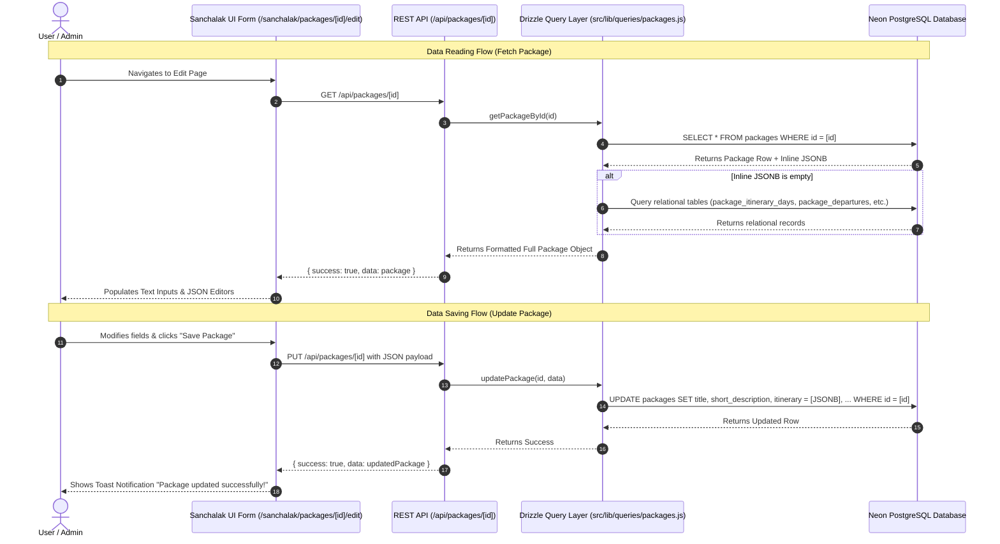

# 🗺️ System Architecture & UI Data Storage Mapping

This document provides a clear, comprehensive guide explaining **where every piece of UI data is stored**, how the **Database tables** relate to the website pages, and how data flows from the **Neon PostgreSQL database** to the frontend UI components and Sanchalak (Admin) Panel.

---

## 🏗️ 1. High-Level Architecture Overview

The system uses a **Hybrid Storage Architecture** designed for high performance, low latency, and ease of content management:

```
[ Neon PostgreSQL Database ]
       │
       ├── Primary Data Storage (packages table with inline JSONB columns)
       └── Relational Fallback Tables (package_itinerary_days, package_departures, etc.)
       │
       ▼ (Drizzle ORM Query Layer)
[ Next.js API Routes / Server Actions ]
       │
       ▼ (JSON REST APIs)
[ Frontend Components & Sanchalak Admin Panel ]
```

### Key Architectural Concepts:
1. **Inline JSONB Storage (Primary)**: Key package sections (itinerary, departure dates, stay options, travel options, places to visit, pickup locations) are stored directly inside the `packages` table as `JSONB` columns (`itinerary`, `join_from`, `stay_options_data`, `travel_options_data`, `places_to_visit`, `departure_dates_data`, `highlights`, `trek_information`, `inclusions`, `exclusions`, `policies`).
2. **Relational Fallback (Secondary / Legacy Support)**: Dedicated relational tables (`package_itinerary_days`, `package_departures`, `package_pickup_locations`, `package_stay_options`, `package_travel_options`, `package_places`) exist for fallback compatibility. If an inline `JSONB` column is empty, the server query engine automatically populates data from these relational tables.

---

## 📊 2. Database Tables & UI Component Mapping Matrix

Below is the complete mapping showing **Database Table Name**, **Column Names**, **Data Type**, and **Which UI Page / Component displays or edits it**.

### A. `packages` Table (Core Entity)

| Database Column | Data Type | UI Page & Component | Description / Function |
|---|---|---|---|
| `id` | `uuid` | Dynamic Routes (`/packages/[slug]`, `/sanchalak/packages/[id]/edit`) | Primary key UUID for package identification. |
| `title` | `varchar(255)` | Package Cards, Header, Package Detail Page (`<h1>`), Admin Form | Package display title (e.g., "Adi Kailash Yatra - Standard 8 Days"). |
| `slug` | `varchar(150)` | Package Page URL Route (`/packages/[slug]`) | URL identifier slug. |
| `starting_price` | `decimal(10,2)` | Pricing Badges, Package Cards, Hero Section, Quick Booking Card | Starting price per person (e.g., `65000.00`). |
| `currency` | `varchar(10)` | Currency formatting utils (`INR` default) | Display currency symbol (`₹`). |
| `starting_point` | `varchar(100)` | Quick Overview Grid, Package Hero, Search Filters | Trip start location (e.g., "Kathgodam / Haldwani"). |
| `end_point` | `varchar(100)` | Quick Overview Grid, Package Hero | Trip end location (e.g., "Kathgodam / Haldwani"). |
| `duration_days` | `integer` | Duration Badge ("8 Days / 7 Nights") | Total trip days. |
| `duration_nights` | `integer` | Duration Badge ("8 Days / 7 Nights") | Total trip nights. |
| `status` | `varchar(50)` | Admin Package List Filter, Frontend API Filter | Status state (`PUBLISHED`, `DRAFT`, `ARCHIVED`). |
| `featured` | `boolean` | Home Page Featured Packages Carousel | Flags package for featured home page display. |
| `short_description` | `text` | Package Card Subtitle, SEO Meta Description | Brief 1-2 sentence summary. |
| `about` | `text` | Package Overview Section | Full rich narrative description of the trip. |
| `highlights` | `jsonb` | Package Overview Section — Bullet Highlights | Array of strings (key highlights of the trek). |
| `trek_information` | `jsonb` | Trek Quick Info Grid (Altitude, Distance, Fitness, Age, Grade) | Key-value pairs for altitude, fitness levels, best season, etc. |
| `inclusions` | `jsonb` | Inclusions Tab / Accordion | Array of included items (Meals, Permits, Guide, Stay). |
| `exclusions` | `jsonb` | Exclusions Tab / Accordion | Array of excluded items (Personal Expenses, GST, Insurance). |
| `policies` | `jsonb` | Terms & Policies Tab (Cancellation, Mandatory Documents, Refund) | Object with policy text blocks. |
| `itinerary_pdf` | `varchar(500)` | "Download PDF Itinerary" Button | Link to brochure / itinerary PDF. |
| `itinerary` | `jsonb` | Itinerary Timeline Component (Day 1 to Day N) | Array of day objects `{ day, title, description, activities, overnight }`. |
| `join_from` | `jsonb` | Pickup / Join From Dropdown & Pricing Selector | Array of cities & prices `{ city, pricePerPerson, pickupPoint, departureTime }`. |
| `stay_options_data` | `jsonb` | Accommodation Selection Cards | Array of stay types `{ title, description, priceAdjustment }`. |
| `travel_options_data` | `jsonb` | Transport Selection Cards (Bolero / Tempo Traveler / Vehicle type) | Array of travel options `{ type, description, priceAdjustment }`. |
| `places_to_visit` | `jsonb` | Key Attractions / Places Grid Component | Array of places `{ name, description, image }`. |
| `departure_dates_data` | `jsonb` | Booking Date Picker Modal / Calendar Widget | Object keyed by month name containing dates & availability status. |

---

### B. Related Auxiliary Tables

#### 1. `package_images` Table
- **Purpose**: Stores all gallery and hero images associated with a package.
- **Columns**: `id`, `package_id`, `image_url`, `alt_text`, `display_order`, `is_cover`.
- **UI Location**: Package Hero Banner, Image Gallery Slider, Admin Image Uploader.

#### 2. `categories` Table
- **Purpose**: Categorizes packages (e.g., "Sacred Yatra", "Trekking", "Cultural Tour").
- **Columns**: `id`, `name`, `slug`, `description`.
- **UI Location**: Package Filter Bar, Category Badges.

#### 3. `gallery_images` Table
- **Purpose**: Global photo gallery displayed across the website.
- **Columns**: `id`, `title`, `image_url`, `alt_text`, `category` (PEAK, LAKE, DARSHAN, CULTURE), `aspect`, `display_order`.
- **UI Location**: Website Gallery Page (`/gallery`).

#### 4. `team_members` Table
- **Purpose**: Displays leadership, mountain guides, and support team members.
- **Columns**: `id`, `name`, `position`, `image_url`, `category`, `role_badge`, `description`, `is_leadership`, `display_order`, `published`.
- **UI Location**: About Us Page (`/about`).

#### 5. `faqs` Table
- **Purpose**: Frequently Asked Questions.
- **Columns**: `id`, `question`, `answer`, `category`, `display_order`, `published`.
- **UI Location**: Home Page & Package Page FAQ Accordions.

#### 6. External Webhook (Google Sheets Integration)
- **Data Saved**: Name, Phone Number, Pilgrim Count, Custom Message.
- **Trigger Component**: Quick Booking Form & Contact Us Inquiry Form (`/api/inquiries`).
- **Storage Target**: Google Sheets (via AppScript Webhook specified in `NEXT_PUBLIC_INQUIRY_API_URL`).

---

## 🔄 3. End-to-End Data Flow



---

## 🛠️ 4. How Admin Sanchalak Form Controls map to Storage

| Admin UI Form Field | Form Component Type | Target Storage Column | Serialization / Format |
|---|---|---|---|
| **Title** | Text Input | `packages.title` | String |
| **Slug** | Text Input | `packages.slug` | String (URL friendly) |
| **Starting Price** | Number Input | `packages.starting_price` | Decimal |
| **Duration Days / Nights** | Number Inputs | `packages.duration_days` / `duration_nights` | Integer |
| **Starting / Ending Point** | Text Inputs | `packages.starting_point` / `end_point` | String |
| **Cover Image URL** | Text Input / Image Picker | `package_images` table | Image URL String |
| **Short Description** | Text Area | `packages.short_description` | Plain Text |
| **About Section** | Rich Text / Text Area | `packages.about` | Plain / HTML Text |
| **Status** | Dropdown (`PUBLISHED`, `DRAFT`, `ARCHIVED`) | `packages.status` | Enum String |
| **Featured** | Checkbox | `packages.featured` | Boolean |
| **Highlights** | Code/JSON Textarea | `packages.highlights` | JSON Array `["Highlight 1", "Highlight 2"]` |
| **Itinerary** | Code/JSON Textarea | `packages.itinerary` | JSON Array `[{ day: 1, title: "", description: "" }]` |
| **Join From (Pickup Points)** | Code/JSON Textarea | `packages.join_from` | JSON Array `[{ city: "", pricePerPerson: 65000 }]` |
| **Stay Options** | Code/JSON Textarea | `packages.stay_options_data` | JSON Array `[{ title: "", priceAdjustment: 0 }]` |
| **Travel Options** | Code/JSON Textarea | `packages.travel_options_data` | JSON Array `[{ type: "", description: "" }]` |
| **Places to Visit** | Code/JSON Textarea | `packages.places_to_visit` | JSON Array `[{ name: "", description: "", image: "" }]` |
| **Departure Dates** | Code/JSON Textarea | `packages.departure_dates_data` | JSON Object `{ "May": [{ date: "2026-05-15", status: "available" }] }` |
| **Inclusions / Exclusions** | Code/JSON Textarea | `packages.inclusions` / `exclusions` | JSON Arrays |
| **Policies** | Code/JSON Textarea | `packages.policies` | JSON Object `{ cancellation: "", terms: "" }` |

---

## 📌 Summary

1. **All core package details and rich structures** (itinerary, dates, pickup cities, stay/travel options, policies) are centralized in the `packages` table using PostgreSQL `JSONB` columns for fast single-query performance.
2. **Relational tables** serve as structured fallback options when JSON fields are unpopulated.
3. **Images, Team Members, FAQs, and Gallery** are normalized into dedicated standalone tables.
4. **User Inquiries** are processed via API and forwarded directly to Google Sheets via Webhooks.
